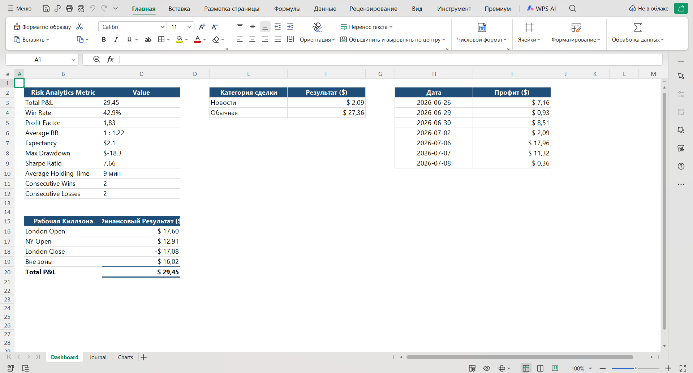
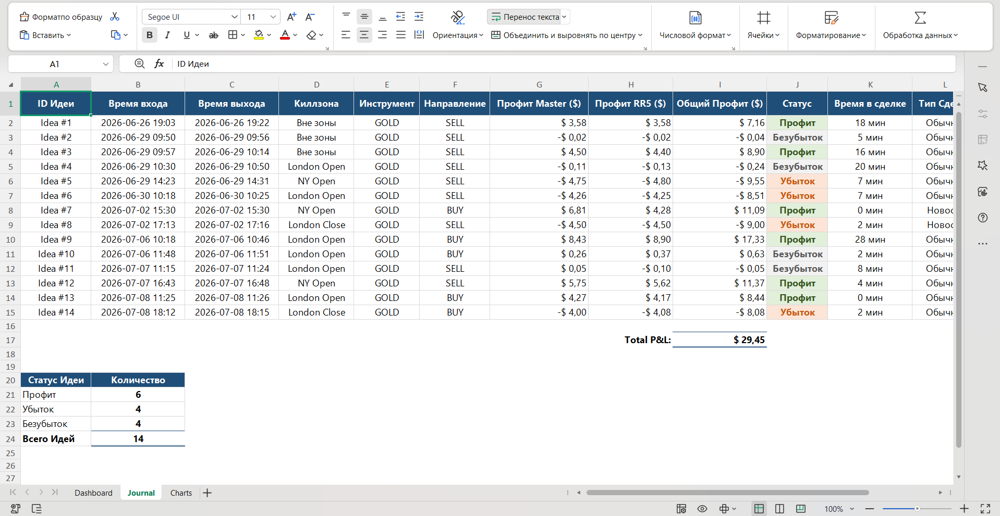
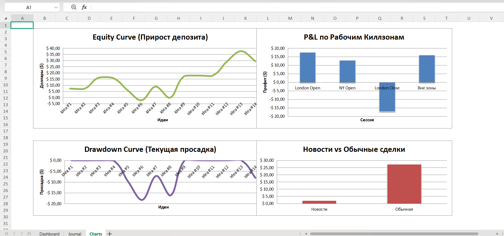

# MT5 Trade Analytics & Risk Reporting System

## Overview

MT5 Trade Analytics & Risk Reporting System is a Python-based reporting platform designed to automate trade performance analysis and risk reporting for MetaTrader 5 traders.

The system automatically imports trade history from MT5, processes performance metrics, analyzes risk exposure, and generates Excel dashboards for trading evaluation.

---

## Key Features

- Automatic trade import from MetaTrader 5
- Trade journal generation
- Performance analytics
- Risk analytics
- Equity Curve generation
- Drawdown analysis
- Win Rate calculation
- Profit Factor calculation
- Expectancy calculation
- Sharpe Ratio calculation
- Average holding time analysis
- Session-based analytics
- News vs Regular Trade comparison
- Automated Excel dashboard generation

---

## System Architecture

```text
MetaTrader 5
     ↓
Python Data Processing Engine
     ↓
Trade Analytics & Risk Module
     ↓
Excel Dashboard & Reports
```

---

## Performance Metrics

The system automatically calculates:

- Total P&L
- Win Rate
- Profit Factor
- Average Risk-to-Reward Ratio
- Expectancy
- Maximum Drawdown
- Sharpe Ratio
- Average Holding Time
- Consecutive Wins
- Consecutive Losses

---

## Trading Analytics

### Session Analytics

Performance is analyzed across:

- London Open
- New York Open
- London Close
- Outside Trading Sessions

### Trade Classification

Trades are categorized into:

- News Trades
- Regular Trades

This allows performance comparison under different market conditions.

---

## Dashboard



---

## Trade Journal



---

## Charts & Analytics



---

## Technologies Used

- Python
- MetaTrader 5
- Pandas
- Excel
- Trading Analytics
- Risk Management

---

## Future Improvements

Planned enhancements:

- Monte Carlo Simulation
- Risk of Ruin Analysis
- Value at Risk (VaR)
- PDF Report Generation
- Streamlit Web Dashboard
- Multi-Asset Support
